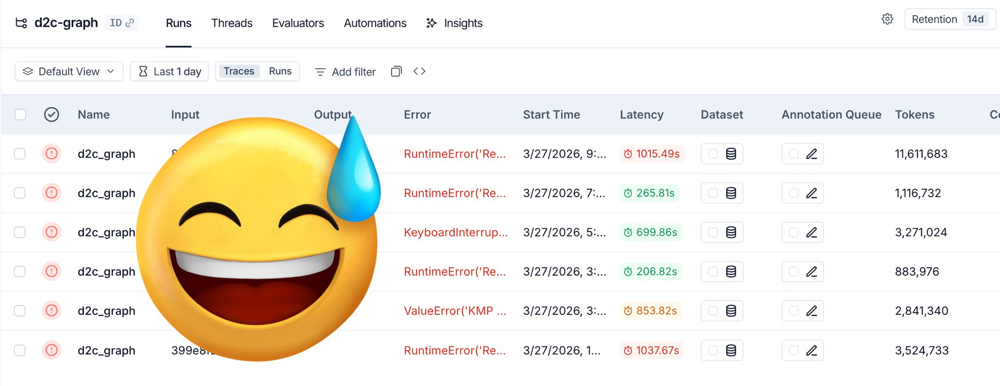

I just wrapped up a small project that turns Figma designs into target code. Here are four real lessons I learned the hard way.

## 1. Don't make the LLM do dirty work—tokens are expensive, attention is precious

This doesn't mean pushing grunt work onto humans. On a real production line, you should turn every messy task that distracts the Agent into a script or deterministic code.

Examples: scaffolding, SDK path configuration, external tool calls that follow a fixed routine.

Keep the LLM's attention on the most important flow. Let it handle the core tasks that actually require reasoning and decision-making.

## 2. Skills aren't silver bullets; they're soft constraints

When a long workflow far exceeds the LLM's context window, the model will inevitably start "skipping steps."

Long contexts dilute the attention weight of early instructions (like the constraints written in a skill). The model isn't actively deciding to skip them; it's probabilistically "forgetting" that constraint.

In my final grading step, I explicitly wrote that the agent must run a "score → feedback → revise" loop using a comparison tool. But the feedback step was often forgotten.

The only fix is to break the flow into smaller stages. But fragmentation has a cost: more context has to be passed between nodes.

## 3. Observability makes your test suite actually valuable

Observability means being able to see every decision, tool call, and result the Agent makes.

Tools like Claude Code or Codex run in a REPL-like interactive mode where you can watch each step, but that requires a human in the loop. On a so-called "pipeline," the Agent runs in a black box. Without observability, you just burn tokens forever with no way to improve or optimize the flow.

That cost multiplies when you run a test suite in batch. If you can't see where things go wrong, you're wasting tokens for nothing. Below is a screenshot from my test runs. I used LangSmith to trace the Agent's behavior.

## 4. Don't just supervise—think deeply

For paths you haven't personally walked, the AI won't know the right direction either.

If you hit a wall, stop and think deeply, then work through it yourself. Don't blindly rely on the LLM to find the path or plan the solution. Humans shouldn't just be supervisors; they should be deep thinkers and guides.

When I was trying to convert absolute layouts into adaptive ones, the LLM's proposals always fell short. So I rolled up my sleeves and rewrote it myself, then distilled the process into a generalizable set of steps.
