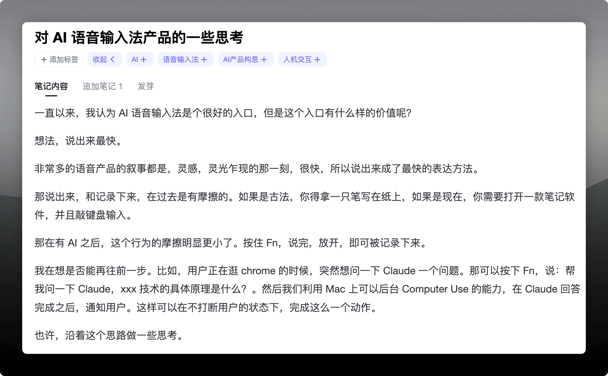
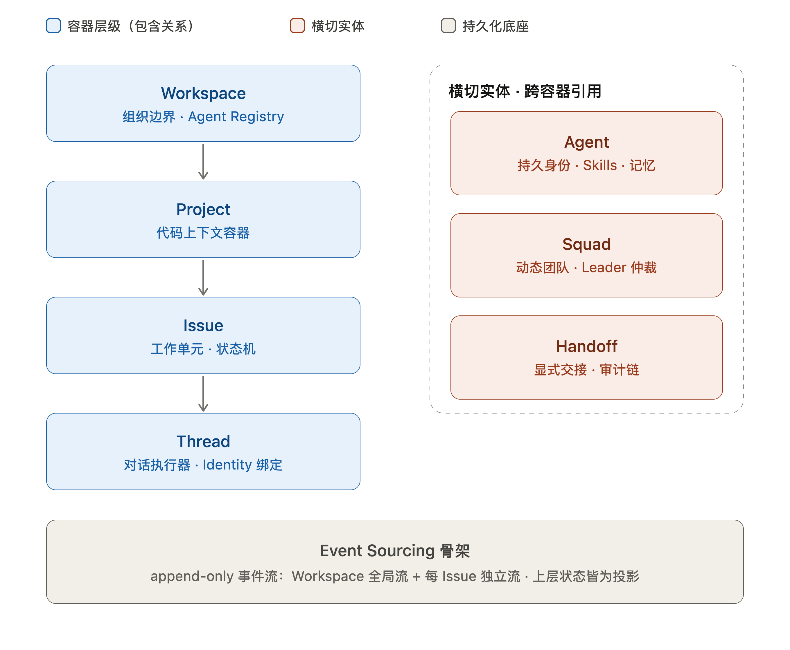

## Preface

Every new journey deserves to be accompanied by written records. That is the origin of this **Indie Dev Weekly** series—hand-typed, raw, and personal.

## A New Journey as an Indie Developer

People often say: **The best time to plant a tree was ten years ago; the second best time is now.**

I find myself believing this quote without much rational basis—perhaps simply because I made up my mind to take the leap and grasped onto a pithy quote for encouragement. Either way, it doesn't matter: when you want to build, just build.

This week marks exactly one full month since I quit my full-time job. On the freelance side, I've closed an AI outbound calling system with a law firm, which is currently in active development. My personal channels are moving steadily ahead: several posts blew up on X, and one went viral on WeChat Official Accounts. Xiaohongshu (RED) has been harder to gain traction on so far; I might pivot toward video content later.

## Products Built on Path Dependence

The product with the highest degree of completion right now is an AI voice IME (Input Method Editor). While many joke that this category has become part of the "new indie developer starter pack" in the AI era (and honestly, it has), for a newcomer like me, it felt like an approachable and natural entry point.

Here are a few distinct aspects and future directions I've been thinking through:

**"Streaming Subtitles"**: Neither Typeless nor Lightning Voice had this feature when I looked (I stopped using them in May, so I'm not sure if they've added it since). My initial motivation was purely that word-by-word streaming pops look cool—a small visual hook for differentiation. But digging into implementation revealed it was far from easy. The local model I chose was SenseVoice Small, which lacks a native streaming decoder. Achieving true real-time streaming output proved difficult, and the current result is still somewhat suboptimal.

**"Zero-Friction Entry Point"**: This is where I want to take the product next. I scribbled the raw inspiration into my Get notes, as shown below. I've always felt that voice input represents a fantastic entry point, but what can we actually trigger from it? Capturing ephemeral inspiration (an idea borrowed from Smartisan's classic Flash Capsule)? Or controlling smart hardware (isn't that just Siri or Xiao AI)? I was stuck for a while, struggling to uncover anything deeper.

Looking at those existing patterns, two core traits stand out: **Immediacy** and **Execution**. Layering them together is what I loosely call **"Zero-Friction"**—the moment a thought sparks, the action begins instantly. With the rapid maturation of background Computer Use in May, the value of this entry point became clear: zero-friction capture combined with timely, non-intrusive delegation. It takes over execution without stealing your focus window, and **notifies you once the job is finished**. That interaction model feels genuinely compelling.

## More Product Ideas

Working daily with these tools sparked two more product ideas:

**Codename Pig**: A companion GUI for the Pi Agent—providing a Dashboard, Tracing, Package Management, and a visual interface. I'm experimenting with building it end-to-end using Multica to explore an autonomous software factory workflow. **My entire engineering background has been in developer tooling; I shouldn't abandon that natural advantage.** Right now, I'm exploring both B2D (developer-facing) and consumer-facing products in parallel.

**Codename Box**: A native macOS client for `sing-box`. The official client's usability leaves much to be desired, so I decided to build my own while testing out Codex's autonomous Goal capability. I ran into considerable friction early on—specifically securing Apple Developer entitlements, which get tricky due to the network extension permissions required by VPN-class software. This single roadblock consumed the bulk of the runtime during autonomous goal runs. But it yielded an invaluable takeaway: **always resolve hard-blocker permissions that require human intervention before launching autonomous goals, and overall execution efficiency will skyrocket.**

## Thoughts on Agent Team Architecture

The first half of this year saw several applications pioneering new paradigms for multi-agent collaboration: Raft (formerly Slock), Multica, and Cumora, among others. Having spent hands-on time with Raft and Multica, each clearly embodies a distinct design philosophy. Here is my attempt to map out their fundamental concepts:

- **Workspace**: The outermost isolation container, defining organizational boundaries, the agent registry, and multi-tenant workspaces.
- **Project**: The context container for code and configuration, typically bound to a Git repository or directory. Projects provide static context (directory tree, dependency graphs, coding conventions, `CLAUDE.md` or `AGENTS.md` files) and establish the environment boundary within which agents operate.
- **Issue / Task**: The unit of work and state machine driver. A trackable work item with a title, description, state, assignee, and priority. Issues govern lifecycle transitions (e.g., `todo` → `in_progress` → `in_review` → `done`), acting as the single source of truth for business state.
- **Thread / DM**: The conversational execution unit, mirroring the execution model of traditional coding harnesses. An append-only sequence of interactions (usually stored as JSONL) serving as the conversation container between agent and user, holding conversation history, tool invocation returns, and compaction state.
- **Agent**: An external agent runtime encapsulation, bundling its own memory, skills, base model, and execution environment.
- **Squad**: A composite group of agents and humans with an orchestrator/leader. Coordination complexity is $O(n)$—a star topology.
- **Channel**: An open coordination space for agents and humans without a central orchestrator. Coordination complexity expands to $O(n^2)$—a mesh topology.
- **Handoff**: A formalized protocol for explicitly passing control and context between agents. It packages structured data (Handoff Packet) such as task summaries, key discoveries, constraints, completed items, and recommended next steps.

Here is a preliminary sketch of the architecture. I plan to spend the coming week putting both tools through deeper real-world testing. Based on what I've explored so far, I lean toward the layered Agent Team model shown below:

As the diagram illustrates, I favor Multica's issue-centric task management approach, which feels well-suited for running an autonomous **"Software Factory"** governing production and oversight. Where my thinking diverges is that I believe Squads should be strictly ephemeral: dynamic strike teams assembled or spawned on the fly by a team lead from an agent pool to accomplish a specific objective, carrying zero persistent state themselves.

The drawback is also apparent: an issue-driven paradigm means agents only activate when work is assigned, falling short on proactive collaboration or emergent innovation. Cumora handles this exceptionally well with dedicated "Whisper Rooms" and "Convene Rooms"—providing an asynchronous, periodic channel for emergent team dialogue.

## Miscellany

Today is Father's Day, but I bought a cake for Mom.
