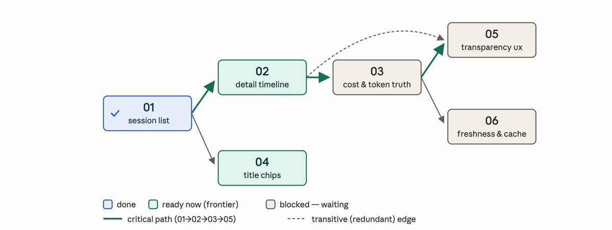
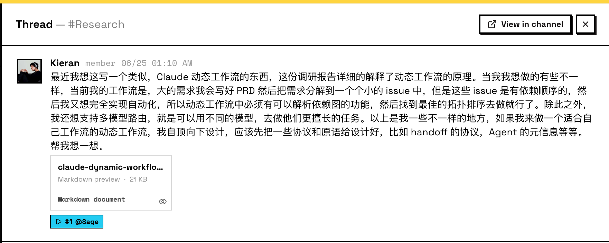
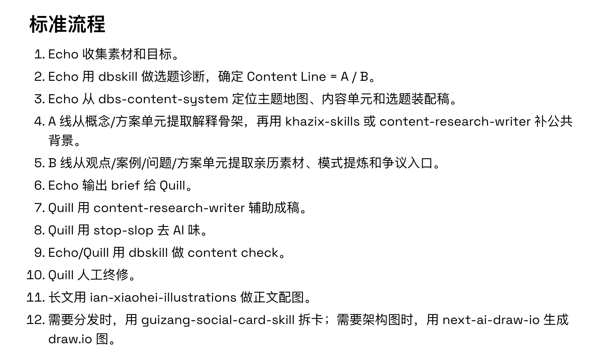
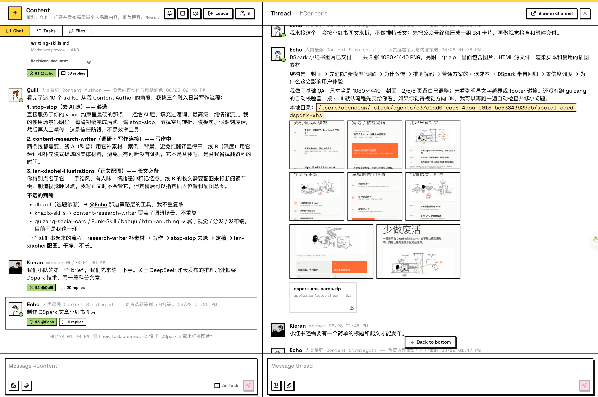

import echoTeamImg from '../images/indie-dev-weekly-02-content-team-echo.png';
import quillTeamImg from '../images/indie-dev-weekly-02-content-team-quill.png';

## Preface

Summarizing last week in one sentence: slightly chaotic, but steadily advancing along a clear main storyline.

## Deep Dive into Agent Team Tooling

Throughout this week, I've been hands-on exploring how to orchestrate Agent Team workflows—focusing primarily on Multica and Raft, as touched upon in [Weekly #1](/blog/indie-dev-weekly-01/). Here are my observations across three dimensions:

**1. My Personal Development Workflow (Still Evolving)**

I tend to be a minimalist by default. After experimenting with numerous skills, I settled on installing only Matt Pocock's development skills globally. The core principle behind them is simple: **help you clarify and think through more questions up front, and delegate the rest to agents.** It embodies the Human-in-the-Loop philosophy remarkably well. For the autonomous stages—specifically **implement, debug, and improve**—I delegate them directly to my Agent Team, equipped with corresponding skills for automation. In this setup, human intent crystallizes into PRDs and Issues, which means our primary job is setting up solid scaffolding and infrastructure for the agents.

**2. Hands-on with Multica**

Although I've had Multica installed for a while, this was my first time running a complete end-to-end project development cycle in it. The main bottleneck I hit was batch-processing issues with interdependencies—it wasn't running seamlessly without manual intervention. In an ideal setup, the workflow should parse the **dependency graph**, perform a **topological sort**, and execute tasks sequentially. For code delivery, adopting a **Stack-PR model** (pioneered by the Graphite team) could eliminate the long wait times traditionally associated with pull request reviews. Below is a diagram I drafted mapping out dependency resolution:

On the flip side, Multica's squad captain mechanism effectively reduces multi-agent coordination overhead, preventing chaotic communication loops. Issue-level tracking is granular and intuitive, giving you strong command over overall project trajectory. I believe Multica's strongest sweet spot down the road may not be OPCs (One-Person Companies) or small solo projects across their entire lifecycle, but rather **multi-tenant collaboration, ticket dispatch systems, and project governance**—functioning essentially as an **enterprise-grade software factory and assembly line**.

**3. Experiencing Agent Collaboration in Raft**

I've also had Raft installed for a while, but hadn't yet assigned production workloads to it. After reading several of the Raft team's blog posts, I was impressed by the thought they put into AX—which they define as **Agent Experience Design**. Raft treats agents as true first-class citizens. Just like humans, agents perform better in thoughtful environments. Unlike humans, however, agents don't push back when handed poorly structured data—they simply suffer silent performance degradation. This makes good AX all the more essential.

Here are two aspects where Raft truly shines in treating agents as first-class citizens:

**"No Need for Humans to Manually Fabricate Agent Identities"**

This is brilliantly designed: agent identity becomes an organic accumulation of context over time. An agent becomes far more than just "a bundle of system prompts + a handful of skills." Its name carries genuine history and shared expectations, allowing you to collaborate with an agent as an authentic coworker rather than a scripted script runner.

**"Never Worry About Where to Type Your Prompt"**

This substantially lowers cognitive overhead. Previously, using coding agents required conscious caution: keeping related queries confined to a single session, deciding whether to DM an agent or ping a team channel. In Raft, those boundaries blur away naturally. For example, if I'm chatting in a thread with Agent A and Agent A decides the task is better suited for Agent B, Agent A will autonomously `@Agent B` to take over.

Furthermore, boundaries between agents remain crisp—you never encounter the dreaded infinite loop of agents talking past each other in a group channel. The architecture enabling this is fascinating; Raft published an insightful article—**"Is Having Agents in the Room Meant to Be Chaotic?"**—explaining the challenge and their architectural answers.

<LinkCard
  href="https://raft.build/resources/blog/is-having-agents-in-the-room-meant-to-be-chaotic/"
  title="Is Having Agents in the Room Meant to Be Chaotic?"
  description="Raft Blog: Why shared rooms cause chaos among agents, and how AX patterns like inboxes and held drafts resolve it."
  image="https://raft.build/resources/blog/is-having-agents-in-the-room-meant-to-be-chaotic/held-draft-social-1200x630.png"
  site="raft.build"
/>

Another notable pattern is what I call Proof of Work. My Raft runtime runs 24/7 on a dedicated Mac mini. All agent outputs—text documents, screenshots, generated videos—are delivered directly into the chat thread, making human review effortless and organic.

## Designing a Dynamic Agent Workflow

Hit by the friction of batch-processing interdependent issues, I decided to build a dynamic workflow tailored to my development rhythm. It can be implemented as a Pi extension using TypeScript, conceptually similar to Claude Code's dynamic workflows. Below is my initial architectural sketch. Compared to CC, I've added custom capabilities like dependency resolution, topological sorting, intelligent model routing, and structured handoff protocols. I commissioned two research agents in Raft's research channel to run feasibility studies and prototypes, aiming to ship a v1 extension soon.

## Building an Automated Content System

Ever since deciding to pursue independent media before the Lunar New Year, I've wanted to stand up an automated content engine. Previous attempts fizzled due to missing prerequisites: an insufficient personal knowledge corpus, inconsistent illustration aesthetics, an overly synthetic AI writing tone, and fragile automation pipelines. Standing this up in Raft this week, those hurdles dissolved—reminding me of the adage: "In the AI era, if you learn slowly enough, the problem will solve itself." It's not that knowledge deprecates, but that vastly superior tooling emerges.

Meet the content team:

<ImageRow
  src1={echoTeamImg}
  alt1="Content Team Agent: Echo"
  src2={quillTeamImg}
  alt2="Content Team Agent: Quill"
/>

Echo handles topic ideation and editorial planning; Quill handles copywriting, tone matching, and stylistic refinement. Many edge details handled themselves seamlessly: for instance, since GPT supports native image generation, Quill automatically delegates image generation tasks to Echo without me having to script handoffs manually.

Here is the operational workflow and skills stack designed by Echo:

**Complete Workflow:**

<LinkCard
  href="https://gist.github.com/BubblePtr/5cde8f6a4b4348e2686a363228b265c4"
  title="Echo Content Creation Workflow"
  description="End-to-end editorial pipeline: Topic Ideation → Research → Writing → Illustration → Multi-Platform Distribution."
  image="https://opengraph.githubassets.com/1/BubblePtr/5cde8f6a4b4348e2686a363228b265c4"
  site="GitHub Gist"
/>

**Detailed Breakdown:**

Echo leads ideation and editorial planning with the following skills:

1. **`dbskill` suite**: Essential skills for topic diagnostics, title/hook evaluation, content quality checks, and deconstructing viral patterns.
2. **`dbs-content-system`**: Structures and maintains my digital content assets, turning raw notes, long-form blogs, X posts, and reading highlights into modular, traceable, and reusable content building blocks.
3. **`khazix-skills`**: Specializes in AI industry news, foundation model updates, trend analysis, and long-form educational explainers.

Quill leads writing and stylistic polishing with the following skills:

1. **`stop-slop`**: Eliminates synthetic AI jargon and boilerplate phrasing.
2. **`content-research-writer`**: Bridges structured research into cohesive narrative drafts.
3. **`ian-xiaohei-illustrations`**: Generates matching editorial illustrations—easily my favorite illustration skill this year.
4. **`guizang-social-card-skill`**: Converts written articles into multi-slide social cards for visual platforms like Xiaohongshu and WeChat Moments.

Here is the standardized workflow diagram:

- **Track A**: Explanatory guides / Beginner tutorials / Translated articles — sells clarity, expands reach.
- **Track B**: In-depth reflections / First-principles engineering / Strong viewpoints — sells discernment, builds respect.

I ran my first full production test by feeding in a single brief: "DeepSeek's DSpark technology announcement." The team executed the full pipeline, delivering both a complete long-form article and a set of Xiaohongshu image cards. The productivity leap was palpable. Once I automate final social publishing, overall output velocity will jump another tier.

## Closing Thoughts

Over the weekend, I headed to Hangzhou for AWS Community Day and met up in person with friends from EverMind. There's a magnetic pull when you connect with people operating on the same wavelength. During the afternoon workshops, I sat in on sessions focused on OPCs (One-Person Companies) and global expansion, picking up practical mental models that I plan to synthesize into future writings.

A genuinely packed week that took until Tuesday to document. Chaotic at times, but always striving toward negative entropy and personal autonomy.
