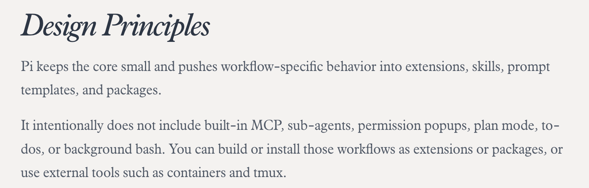
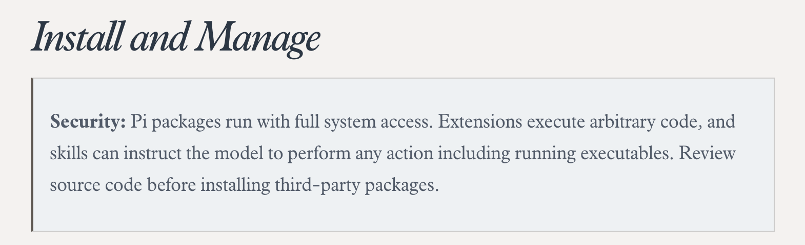

## What Is Pi?

Pi is also known as the Pi Coding Agent. If you haven't heard of it yet, you've almost certainly heard of OpenClaw. Pi is the coding agent framework powering OpenClaw. Its minimalist design philosophy is by far its most widely acknowledged hallmark.

Before diving in, let's understand Pi's capability boundaries.

Everything revolves around radical minimalism: out of the box with zero configuration, Pi only supports four core tools: `bash`, `read`, `write`, and `edit`. There is no built-in MCP, no sub-agents, no plan mode, and no permission confirmation popups. Nothing is pre-bundled; everything must be composed by you. If you are looking for an out-of-the-box coding agent, you might prefer Codex or Claude Code instead.

As the author's design principles state, Pi keeps its core razor-thin, pushing workflow-specific behavior into extensions, skills, prompt templates, and packages. Below, I'll walk through these customizable building blocks and show how to assemble your own custom harness.

## What Are Extensions?

Extensions are the foundational abstraction in the Pi framework. They are TypeScript modules designed to extend Pi's runtime behavior. They can subscribe to lifecycle events, register custom tools callable by the LLM, inject slash commands, and more. Located under `.pi/agent/extensions/*`, Pi discovers them automatically and supports hot-reloading via the `/reload` command.

Here are the key capabilities of extensions:

1. **Custom Tools & Commands**: Register LLM tools via `pi.registerTool()` and slash commands via `pi.registerCommand()`.
2. **Event Interception**: Intercept or mutate tool calls, inject context dynamically, or customize context compaction. Pi offers a rich set of lifecycle events to hook into, covering virtually any operational requirement. See the [official documentation](https://pi.dev/docs/latest/extensions#events).
3. **User Interaction & Custom UI**: Pi allows you to customize interaction logic and terminal rendering—whether crafting interactive Q&A prompts, styling custom editors, or running mini-games (like Snake or Space Invaders) while waiting for model responses.
4. **Session Persistence**: Persist state across restarts using `pi.appendEntry()`, perfect for extensions like session-persistent TODO lists.

This architecture feels unmistakably like Neovim plugins: familiar `export function` conventions and fine-grained lifecycle hooks.

**How Do You Write a Pi Extension?**

In the AI era, there's no need to handcraft code from scratch like writing Lua for Neovim. The simplest approach is often describing your requirements directly to Pi, having it generate the extension, and immediately verifying it via hot-reload. For example, you can tell Pi:

> I want to write a Pi Extension named `permission-gate` that prompts for user confirmation before dangerous bash commands (`rm -rf`, `sudo`, etc.).

Or if you'd like to recreate Claude Code-style hooks through extensions:

> I want to write an extension named `CC-hooks` that wraps Pi's native event interception into Claude Code-style hook conventions.

## What Are Prompt Templates?

Prompt templates function similarly to custom slash commands in Claude Code, whereas the custom commands registered by extensions mentioned earlier are even more powerful because they can call internal Pi APIs.

**Format**: A markdown file with YAML frontmatter.

**Frontmatter**: Contains `description` and `argument-hint`, both optional, which appear in the interactive command menu.

Templates also support positional arguments and slicing, such as `$1`, `$2`, and `${@:N}`. For details, refer to the [Prompt Template Arguments documentation](https://pi.dev/docs/latest/prompt-templates#arguments).

## What Is a Pi Package?

A Pi Package is another high-level abstraction: simply put, it is a bundled collection of extensions, skills, prompt templates, or themes. This makes Pi setups straightforward to distribute and install via Git or npm. It resembles a distribution concept, but with modular coexistence: a single setup can install multiple packages simultaneously. It is **the atomic distributable unit of a Pi configuration**.

However, convenience comes with security considerations. Pi's creator explicitly emphasizes security: Pi packages run with full system privileges. Extensions can execute arbitrary code, and skills can instruct the model to perform any action, including executing binaries. Always audit the source code before installing third-party packages.

Creating Pi packages can also be automated directly by Pi. Check the [official package documentation](https://pi.dev/docs/latest/packages).

## Recommended Pi Packages

As of May 2026, [pi.dev/packages](https://pi.dev/packages) indexes **over 3,328 packages**. Here are 10 packages from my own daily setup. At the end of the post, I've also linked Pi Index, a directory site I built for discovering packages.

1. **`context-mode`**: Saves up to 98% of your context window with sandboxed code execution, an FTS5 knowledge base, and intent-driven search. A must-have for every Pi user.
2. **`pi-subagents`**: Delegates tasks to sub-agents with chaining, parallel execution, and interactive TUI confirmations—enabling a primary agent to orchestrate multi-agent workflows for complex tasks.
3. **`pi-mcp-adapter`**: MCP (Model Context Protocol) adapter allowing Pi to connect to external MCP servers and extend tool capabilities (databases, APIs, filesystems, etc.).
4. **`pi-web-access`**: Adds web search, URL fetching, GitHub repository cloning, PDF extraction, and YouTube video summarization to bridge Pi's lack of internet access.
5. **`pi-lens`**: Real-time code intelligence—LSP diagnostics, linters, formatters, type checking, and structural code analysis.
6. **`pi-simplify`**: Automatically audits recent diffs for clarity, consistency, and maintainability—your automated code quality gatekeeper.
7. **`@juicesharp/rpiv-todo`**: Equips the model with a persistent TODO list rendered as a live terminal overlay, surviving both `/reload` and context compaction.
8. **`@plannotator/pi-extension`**: Interactive plan review and inline annotations. Lets you annotate agent messages and review code/PR plans before executing complex changes.
9. **`@narumitw/pi-goal`**: Implements `/goal` mode, keeping the agent autonomously focused until the task is complete.
10. **`@narumirw/statusline`**: A rich status bar displaying current model, active tools, git branch, context window usage, total tokens, cost, and elapsed time.

## Pi Index

If you'd like to explore more Pi packages, I built a continuously updated directory site supporting category browsing, bilingual search (English and Chinese), and one-click install commands:

<a class="site-card" href="https://piindex.dev/" target="_blank" rel="noopener noreferrer">
  
  
    piindex.dev
    Pi Index — A curated directory for Pi Coding Agent
    A curated directory of community packages, themes, and tools. Browse by category, search in English and Chinese, and copy install commands with one click.
  
</a>

## Closing Thoughts

Back when I was tinkering with Neovim, I wasn't just searching for a superior tool—I was looking for a medium that mirrored how I think through the act of toolcraft. Pi brought that exact spark back to life.
