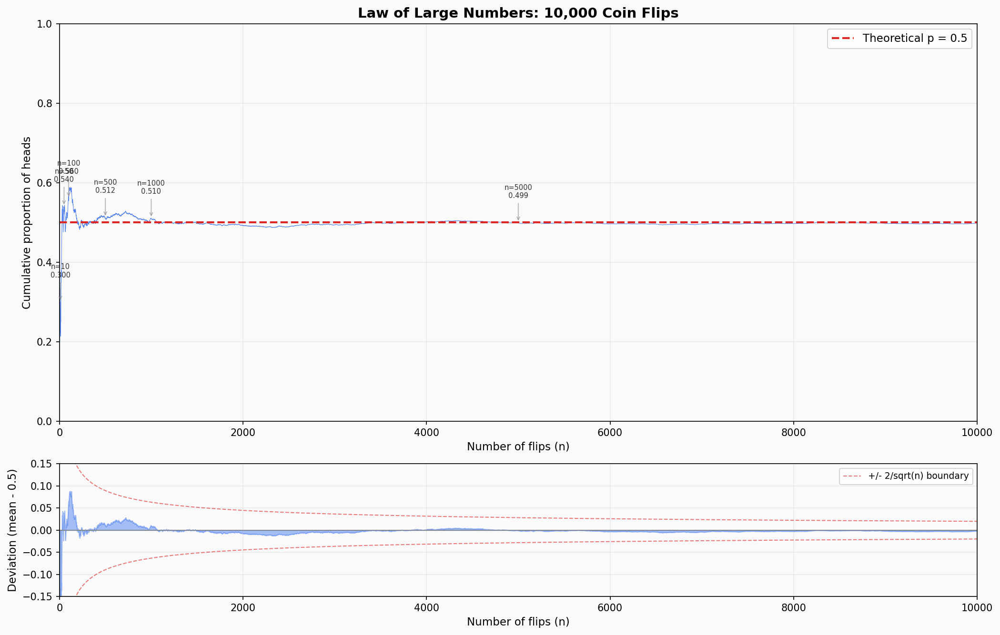

import DemoBrowser from '../../../components/mdx/DemoBrowser';

This is my first study note on quantitative trading.

Recently, I had the Hermes Agent set up a quantitative trading wiki using llm-wiki, and fed two articles from [@MrRyanChi](https://x.com/MrRyanChi) into it.

---

## Law of Large Numbers Experiment

Simulating a 10,000 coin toss experiment in Python yields the following result:

In the plot above, the vertical axis represents cumulative proportion—the probability of landing heads across the first $N$ tosses.

This illustrates the core intuition behind the Law of Large Numbers: when $n$ is small (for instance, only 30% heads in the first 10 tosses), the sample mean fluctuates wildly. As $n$ increases, the curve tightens as though held by an invisible leash ($p=0.5$), eventually converging almost perfectly.

The lower subplot plots the deviation: $\text{Deviation} = \text{Mean} - 0.5$.

It shows the rate at which deviation decays. The red dashed lines mark the theoretical $\pm\dfrac{2}{\sqrt{n}}$ boundaries—the Central Limit Theorem tells us that roughly 95% of deviations fall within this envelope. As we can see, most of the blue fluctuations stay neatly confined within the red lines, and the bounds contract rapidly.

The connection to prediction markets like Polymarket is direct: when a market only has a handful of trades, prices can be pushed to absurd extremes by a few orders. But as trading volume climbs, market prices converge toward their true probabilities. A market maker's edge stems precisely from providing liquidity when $n$ is small and volatility is high.

---

## Bayes' Theorem

$$
P(A \mid B) = \frac{P(B \mid A)\,P(A)}{P(B)}, \quad P(B) > 0
$$

**Formula interpretation:** Given that event $B$ has occurred, the conditional probability of $A$ equals the prior probability of $A$, multiplied by the likelihood of $B$ occurring assuming $A$ happens, divided by the marginal probability of $B$ itself.

This is not a static formula; it describes how to update the probability of $A$ after observing that $B$ has occurred. In engineering terms, it answers this question: **How do we continuously update our beliefs under incomplete information and imperfect evidence?**

### How Is This Useful in Quantitative Trading?

Translated into a trading context:

$$
P(\theta \mid data) = \frac{P(data \mid \theta)\,P(\theta)}{P(data)}
$$

- **Prior** $P(\theta)$: Your assessment of market regime before looking at today's market action (e.g., a 60% chance of a bull market).
- **Likelihood** $P(data \mid \theta)$: The probability of observing current market signals if the market is indeed in that regime.
- **Posterior** $P(\theta \mid data)$: Your updated assessment after synthesizing today's incoming data.

Put more intuitively:

- You hold an initial belief (e.g., "I think there is a 50% probability this event happens").
- Suddenly, new evidence arrives (e.g., breaking bullish news).
- You ask yourself two questions: If this event will indeed occur, how likely was this news? If this event won't occur at all, how likely was this news?
- Based on the answers, you calibrate your prior belief (e.g., revising upwards from 50% to 58%).

### A Real-World Example on Polymarket

<DemoBrowser
  src="/demos/polymarket-bayes/index.html"
  title="Polymarket Bayesian Analysis Demo"
  height={520}
  client:visible
/>

---

## The Kelly Criterion

$$
\boxed{f^* = \frac{pb - q}{b}}
$$

Where $f^*$ is the optimal fraction of capital to wager, $p$ is the win probability, $b$ is the odds (payout multiple), and $q = 1-p$ is the loss probability.

The Kelly Criterion answers a fundamental question: **In a positive-expectation wager, what proportion of your bankroll should you bet each time to maximize long-term wealth growth?**

It identifies the exact mathematical balance between **maximizing expected payoff** and **controlling the risk of ruin**.

Let's derive it step by step:

### Setup

Assume your starting capital is $W_0$, and you wager a fraction $f$ on each round (i.e., staking $f \cdot W$).

Each round:

- With probability $p$, you win, and your wealth becomes $W(1 + fb)$
- With probability $q = 1 - p$, you lose, and your wealth becomes $W(1 - f)$

Here $b$ is the payout ratio (net gain of $b$ dollars for every dollar staked upon winning).

### Step 1: Wealth After n Wagers

After betting $n$ times, assuming $k$ wins and $(n - k)$ losses:

$$
W_n = W_0 \cdot (1 + fb)^k \cdot (1 - f)^{n - k}
$$

This is a **multiplicative process**—each outcome scales your previous bankroll by a factor.

### Step 2: Why Not Simply Maximize Expected Value?

Intuitively, you might want to maximize $\mathbb{E}[W_n]$. Let's calculate:

$$
\mathbb{E}[W_n] = W_0 \cdot [p(1+fb) + q(1-f)]^n
$$

Taking the derivative with respect to $f$ and setting it to zero reveals that whenever $pb > q$ (a positive expectation game), you should choose $f = 1$—in other words, **go all-in**.

Yet going all-in is catastrophic: a single loss wipes out the entire bankroll to zero, from which recovery is impossible. Expected value is heavily inflated by rare paths where you win every round, masking the guarantee of eventual ruin.

Expected value maximization fails because it overlooks the **multiplicative compounding structure** of wealth growth.

### Step 3: Shift Objective—Maximize Long-Term Growth Rate

Take the logarithm of $W_n$:

$$
\log W_n = \log W_0 + W \cdot \log(1+fb) + L \cdot \log(1-f)
$$

The **average growth rate per round** (logarithmic growth rate) over $n$ bets is:

$$
G = \frac{\log W_n - \log W_0}{n} = \frac{W}{n} \cdot \log(1+fb) + \frac{L}{n} \cdot \log(1-f)
$$

As $n \to \infty$, by the Law of Large Numbers:

$$
\frac{W}{n} \to p, \quad \frac{L}{n} \to q
$$

Thus, the long-term growth rate converges to:

$$
G(f) = p \cdot \log(1+fb) + q \cdot \log(1-f)
$$

**This is the true objective function we need to maximize.**

### Step 4: Differentiate with Respect to f

$$
G(f) = p \cdot \log(1+fb) + q \cdot \log(1-f)
$$

Differentiating with respect to $f$:

$$
G'(f) = \frac{pb}{1+fb} + \frac{-q}{1-f}
$$

Setting $G'(f) = 0$ yields:

$$
\boxed{f^* = \frac{pb - q}{b}}
$$

### Step 5: Verify That This Is a Maximum

Compute the second derivative of $G(f)$:

$$
G''(f) = -\frac{pb^2}{(1+fb)^2} - \frac{q}{(1-f)^2}
$$

Since both terms are negative, $G''(f) < 0$ always holds. The function is **strictly concave**, confirming that $f^*$ is indeed a global maximum.

### Step 6: Adapting to Polymarket's Binary Structure

On Polymarket, you buy shares at market price $p_m$, and if the event materializes, each share pays $1$. Therefore:

- If you win, net profit is $1 - p_m$, giving odds $b = \dfrac{1 - p_m}{p_m}$
- If you lose, you lose $p_m$, meaning $f$ units correspond to a loss proportion of $p_m$

Substituting into $f^* = \dfrac{pb - q}{b}$, with $q = 1 - p$:

$$
f^* = \frac{p \cdot \dfrac{1-p_m}{p_m} - (1-p)}{\dfrac{1-p_m}{p_m}}
$$

Simplifying:

$$
\boxed{f^* = \frac{p - p_m}{1 - p_m}}
$$

**Your posterior probability minus market pricing, divided by the downside margin.** The larger your edge, the heavier the position; with zero edge ($p = p_m$), your allocation is zero.

The Kelly Criterion provides a rigorous mathematical framework for sizing positions, turning **position management** into a computable optimization problem.

### Practical Implications in Quantitative Trading

1. **Fractional Kelly in Practice**

In live trading, practitioners overwhelmingly prefer Fractional Kelly (such as Half-Kelly). Full Kelly creates substantial psychological stress during inevitable drawdowns; while mathematically optimal, it is hyper-sensitive to estimation errors in $p$. Sacrificing a slice of peak theoretical growth rate in exchange for a much smoother equity curve is a tradeoff most funds gladly make.

2. **Bridging with Bayesian Updating**

The Kelly formula requires $p$—your estimate of the event probability. Where does $p$ come from? It is supplied directly by the posterior probability from Bayesian updating. The two paradigms fit together naturally: **Bayes estimates the probability; Kelly sizes the position.**
