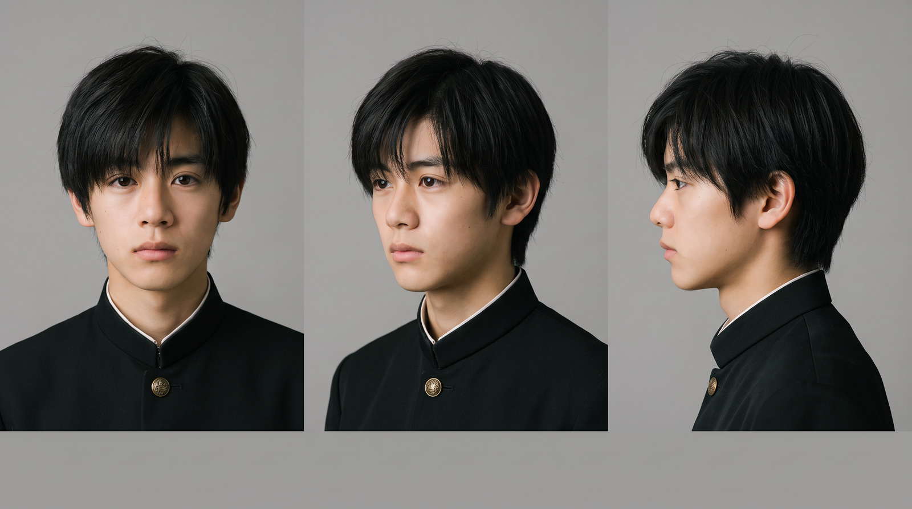
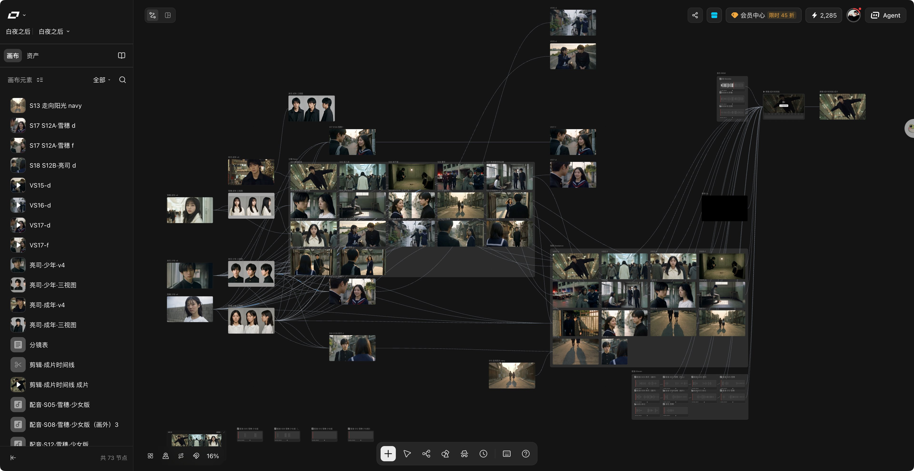
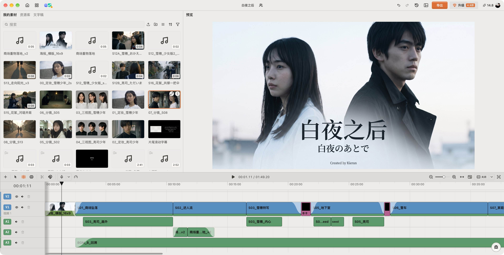

废话不多说，直接上干货，全程口喷从零制作一个 AI 短片。

四个步骤：

1. 人物、场景定妆
2. 分镜、脚本
3. 视频生成、语音生成、BGM 生成
4. 剪辑、字幕

三个工具：Claude Code、LibTV、ChatCut

## 1、人物定妆与场景照

推荐使用模型 GPT Image 2 和 Midjourney，前者生成效果非常好，人物自然符合基本直觉；后者带有强烈的艺术风格和色彩，这也是 mj 一直在生图圈地位不可撼动的原因。

第一步非常重要，因为所有的视频都是围绕着这两个资产去制作的。人物没生成好，场景没设计好，会大大增加抽卡的概率。

那什么样的人物和场景才是一个好的资产？

对于人物来说，正面是最重要的，这是给人印象最深的地方；其次就是头部三视图，再到全身人物设计图，头部三视图可以保证在特写镜头中人物的一致性，而人物设计图所对应的就是稍远的镜头里，人物整体在画面前后的一致性。另外，如果剧情里有可以贯穿主线的道具，也注意要生成图片来保持一致性。

场景对一致性要求偏低一些，只要不是出入太大，一般人是感觉不出来的。而且场景要随着剧情变化，不同也很正常。

## 2、分镜和脚本

分镜其实我都是让 AI 先写，然后自己再慢慢改，如果你有固定的剧本是很好改的。但如果，你更偏向创作，那就需要脑海中不断的想象画面，然后和 AI 去聊帮你修改分镜内容，这种情况下也非常容易返工。因为往往有些镜头你放在一起串起来看，才会觉得不合理。这其实是我做为一个编导方面一点懂的人，最要学习的。

脚本一般就是对人物动作的描写和说话内容以及旁白的描写，这里要注意的点有几个。首先，为了保持音色的一致性，seedance 官方推荐提供一个参考音频，对于说话比较多的视频非常建议这样做。

当然你也可以不依赖视频模型去生成声音做后期配音，但是我依然推荐生成声音，后期有统一的配音之后，再去对口型。口型这方面要注意的就是语言，要按照你配音的语言去生成。

分镜的生成我会选择人物一致性更好的模型，这里就不给推荐的模型了，在大家自己使用的平台上按照它推荐的就可以了。

人物和场景定妆是打地基，让你的人物符合自己的想法，场景更精美。而分镜的生成是保证出视频的一致性。

## 3、最花 token 的抽卡环节

这恐怕是大部分人最容易放弃的环节。为什么会放弃？

生成的视频总是不满意，一直抽卡钱包疼，看着余额不断变少，怕自己做不完；配音和 BGM 也是如此，不过这两个倒是可以用一些现成的进行参考，用一些比较有代表性的声音、用现成的歌或者纯音乐做 BGM。

那如何避免抽卡？其实避免不了，但是如果把前面几步给做好了，可以大大减少抽卡的次数，这时什么三视图、造型图的准备工作就起到作用了。在第一步一定不要偷懒不做，因为现在视频模型的人物一致性已经很好了，所以参考图是至关重要的。

## 4、剪辑和字幕

最后一步，也是能把废品变成艺术品的步骤。

其实做过剪辑你可能会发现，有些画面或镜头拍出来很普通，但是一配上 BGM 马上就变高级了。

在这一步不要过于死板，视频生成啥样你就原封不动的拼接上去，不是这样的。你要把前面三步生成的东西，变成你剪辑的素材，然后拿好这把剪刀，把这些素材拼接成一件艺术品。

我强烈推荐使用 chatcut 进行剪辑，会非常节省时间，Agent 通过 chatcut 的插件可以帮你完成 80% 的工作。那剩下 20% 自己手动调，你和 AI 描述的再清楚，不如你自己去拖动一下时间轴，试试不同的转场效果。

字幕也很重要，有些视觉效果是只能由字幕去呈现的。所以要重视起来，在不同的衔接处加上说明性的字幕，可以让观众更快的带入场景。

## 5、最后总结工具

三件套 = Claude Code + LibTV + ChatCut

使用这三个工具，你完全可以靠口喷去完成一个视频。Agent 会把 LibTV 的画布和 Chatcut 的剪辑台当成工具，Claude Code 就是连接你和工具之间的桥梁。所以，不要觉得复杂，如果你真的想用 AI 制作短片，就马上开始，除了高昂 token 费用，其他的工具使用成本都已经基本被 AI 抹平了。

我的第一部短片[《白夜之后》](https://x.com/ninthbit_ai/status/2095492312579055650)虽然没有很高的流量，但我心里还是非常满意的，也算是圆了一个很久以前的梦。煽情的说，制作的过程让我找到大学时熬夜为校宣传部剪片子的感觉，那时非常想拍一部属于自己的校园电影，或许以后一定会实现的。
