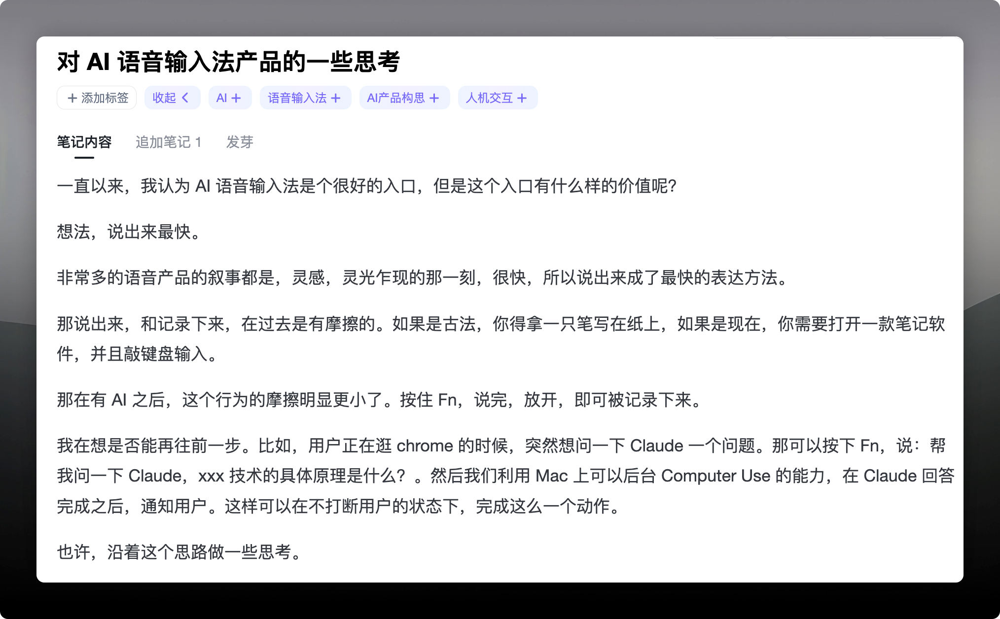
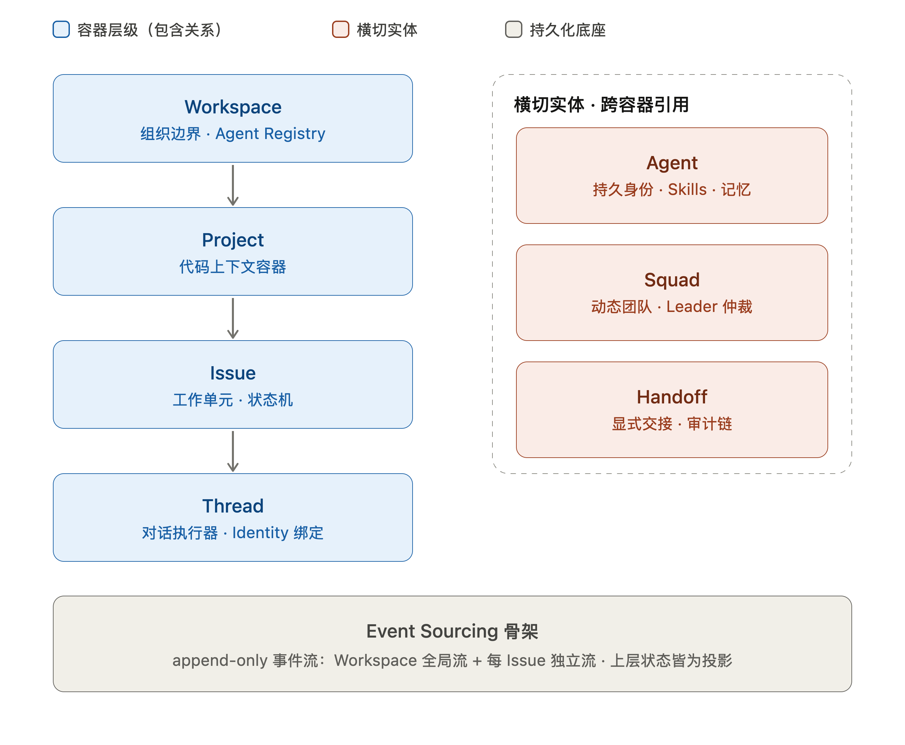

## 前言

一段新旅程的开始，也想伴随着一些文字的记录，便有了**独立开发周报**这个系列，以人格担保纯手敲，以后简称「周报」。

## 独立开发的新旅途

总有人说：**种一棵树，最好的时间是十年前，其次就是现在**。

我没来由相信这句话，可能只是因为我想做了，才找出这么个金句来鼓励自己。Anyway 不重要，想做就做。

裸辞到这周正好一个月了，外包项目只和一个律所谈了一个 AI 外呼的项目，还在开发中。自媒体稳步向前中，推特爆了好几篇文章，公众号也爆了一篇；小红书目前来看不太好做，以后可能会转战视频。

## 路径依赖下的产品

目前完成度比较高的一个产品是 AI 语音输入法，虽然很多人说，这类产品已经变成 AI 时代的「新独立开发三件套」了（不得不承认确实是这样）但对我这个新人来说，也算是符合新手路径的。

下面聊一聊，一些独特的地方和以后的方向。

**「流式字幕」**，Typeless 和闪电说都没有（我 5月份开始就没用过这俩了，不知道后面有没有加上），其实做这个的初衷，就是觉得 partial 蹦字儿的效果比较酷，想靠特效做差异化。后面做下来发现还真不是个容易的事儿，主要在于本地模型我用的是 SenseVoice Small，没有原生 streaming decoder，达不到真流式输出的效果，到目前为止效果也不是很好。

**「零摩擦入口」**，这是未来准备做的方向。这个 Raw 灵感我记录在 Get 笔记里，如下图。我一直觉得语音输入法是个很好的入口，但我们能利用这些入口做什么呢？记录灵感，这是从老罗的闪念胶囊那寻来的；再来一个，控制一些设备，这不是 Siri / 小爱同学吗？实在苦恼，想不出来更多了。

但有两点，我想可以从上面的产品中抽出来。**一是即时，二是执行**。这两点叠加我勉强称为**「零摩擦」**—— 我想到了，我马上开始这个动作。并且在 5 月份由于后台 Computer Use 技术的成熟，我越发觉得这个入口的意义在于零摩擦和适时干扰，在不丢 Focus 窗口的情况下，帮你完成你的想法，并在**合适的时机通知你任务已完成**，这个体验貌似不错。

## 更多的产品想法

在使用工具的过程中，又萌生了两个想法。

**产品代号 Pig**：Pi Agent 的伴侣，Dashboard、Trace、Packege Manage，GUI。尝试端到端使用 Multica 构建，探索自己的软件工厂工作流。**过去做的工作都是开发者工具，我觉得我不应该放弃这个优势**，D 端产品和 C 端产品目前都在尝试。

**产品代号 Box**：sing-box 的 macOS 原生客户端，官方的做的实在有点难用，所以想自己做一个，顺便实验一下 Codex 的 Goal 怎么样。目前感受到很多阻力，比如申请苹果开发者的 entitlement，因为 VPN 软件的特殊性，在权限这里会比较麻烦。这也是在跑 goal 过程中浪费时间最多的一步，但由此得到一些经验，以后**可以先把这些必须 Human 接管的 Blocked 级别问题解决，再开始跑 Goal 效率会更高**。

## Agent Team 架构的一些思考

今年上半年感觉涌现了好几个多 Agent 协作新范式的应用，列举几个：Raft（前 Slock）、Multica、Cumora。目前体验过的只有 Raft 和 Multica，两个产品各有自己的设计哲学。我尝试把一些 Concept 列出来。

**Workspace**：最外层的隔离容器，组织的边界，Agent 的注册仓库，多租户的工作空间。

**Project**：代码与配置的上下文容器，通常绑定到一个 Git 仓库或文件系统目录。Project 提供静态上下文（文件结构、依赖关系、编码规范、`CLAUDE.md` 或 `AGENTS.md` 等配置文件），是 Agent 执行编码工作的环境边界。

**Issue / Task**：工作单元，状态机。可追踪的工作单元，具备标题、描述、状态、负责人、优先级等属性。Issue 驱动状态机（如 todo → in_progress → in_review → done），是业务状态的单一来源。

**Thread / DM**：对话执行器，传统的 Coding Harness 的执行单元。一次连续交互的上下文序列，通常以 append-only 的 JSONL 文件持久化，Thread 是 Agent 与用户进行对话的容器，承载对话历史、工具调用结果、compaction 状态等。

**Agent**：其实是一个外部的 Agent Runtime，包含自己的记忆、Skills、Model、Environment。

**Squad**：Agent 和 Human 组成的集合，有 Orchestrator/Leader，负责编排，协作复杂度是 O(n) —— 星型拓扑。

**Channel**：Agent 和 Human 组成的频道，无 Orchestrator，协作复杂度来到了 O(n²) —— Mesh 模式。

**Handoff**：Agent 之间显式传递控制权和上下文的协议机制，包含结构化的交接包（Handoff Packet），如任务摘要、关键发现、约束条件、已完成事项、建议下一步。

就先整理到这，两个软件我下周还需要深度使用，再做评价。从目前有限所学来看，更倾向如下的 Agent Team 架构：

可以看出来我其实更喜欢 Multica 的这种任务管理的形态，觉得更适合作为**「软件工厂」**，去做管理和生产。有分歧的地方是我认为 Squad 应该是临时性的组织，它可以是动态的，由队长去 Agent 池子里抓取或者创造合适的队员完成任务，小队本身不承担任何上下文。

缺点也很明显，Issue 模型的问题在于 Agent 只在被分配任务时工作，缺乏主动协作和涌现创新，这点在 Cumora 中就设计的非常好，Agent 之间有自己的 Whisper Room 和 Convence Room，这是一种间歇性的非同步协作方式。

## 杂记

今天是父亲节，但我给妈妈买了蛋糕。
