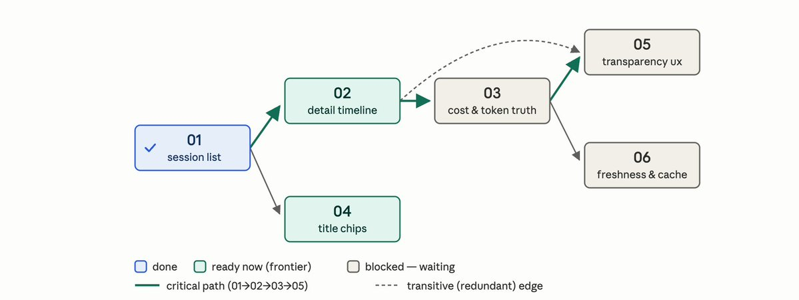
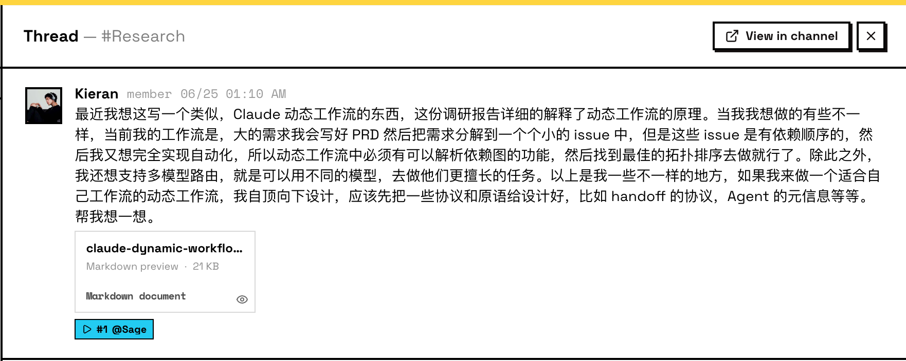
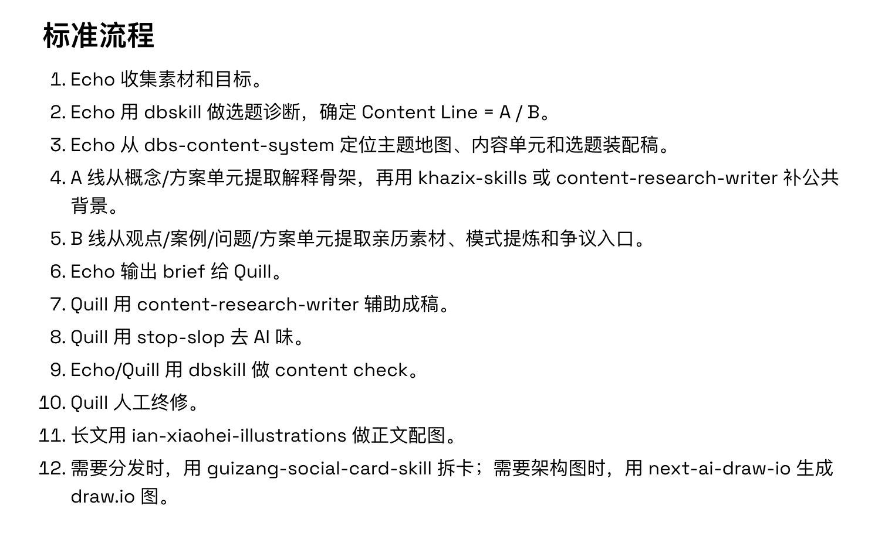
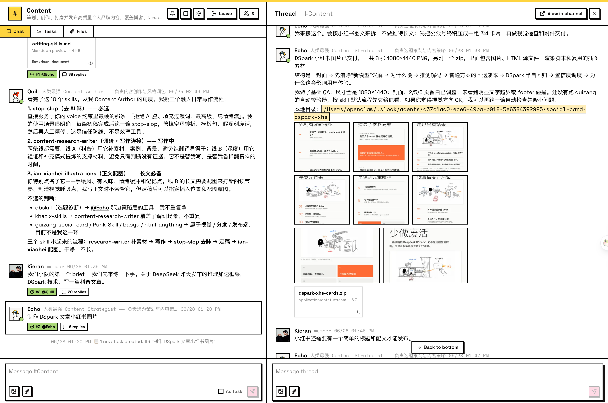

import echoTeamImg from '../images/indie-dev-weekly-02-content-team-echo.png';
import quillTeamImg from '../images/indie-dev-weekly-02-content-team-quill.png';

## 前言

一句话总结上一周，混乱但有主线的前进着。

## Agent Team 深入使用体验

这周我一直在探索 Agent Team 的工具如何使用，如 [周报 #1](/zh/blog/indie-dev-weekly-01/) 中提到的主要是 Multica 和 Raft 这两款软件。我会从以下三个点来谈这件事情。

**第一，我自己的开发工作流（还在探索中）。**

我自认是个喜欢做减法的人，所以在经历过多个 skill 的洗礼之后，我只在全局安装了 matt pocock 的开发 skills，这套的核心其实是：**帮助你想清楚更多的问题，其他的交给 Agent**，对于 Human in the loop 的理念践行地很到位。自动化的部分，我希望交给我的 Agent Team 去做，其中包括 **implement / debug / imporve** 这三阶段，都有对应的 skill 去让 Agent 进行自动化。那么 Human Intent 在这套流程里实际上成为了 PRD / Issues，所以要为 Agent 做好后面的基建。

**第二，首先我开始了 Multica 的使用。**

其实也用了很久 Multica 了，但是没有从头去实践过一个项目完整的开发流程。在这次尝试中，我遇到的障碍是，批量处理有依赖关系的 issues 时，无法做到很流畅地自动化运行。我理想中的流程应该是：先分析**依赖图**，然后找到一个**拓扑排序**，按顺序来执行；在提交上，可以通过 **Stack-PR 模型**去做提交，可以避免代码 review 带来的长时间等待问题。Stack-PR 我后面也准备仔细研究一下，是否真的那么有用，由 Graphite 团队提出的概念。

再说优点，小队的队长机制让 Agent 之间的分工协作复杂度降低，更不会混乱的局面，每个 Issue 的问题跟踪清晰明了，对项目整体的把控也是很方便。所以我觉得未来 Multica 的主战场可能不是 OPC 或者说小项目全周期的使用，更适用于**多租户协作、问题单系统、项目管理**等方面，更像一个**企业级项目工厂和流水线平台**。

**第三，开始尝试 Raft 的 Agent 协作体验。**

Raft 我也安装很久了，但是一直没有把活安排上去。我是先看了 Raft 的几篇博客，我觉得 Raft 团队是真的在 AX 上下了功夫的，以后也许会开一篇单独谈一下 AX，他们定义为 **Agent Expirence Design**。Raft 始终把 Agent 放在一等公民的位置，所以他们也需要对软件有更好的体验，但 Agent 和人类也有区别，Agent 读取数据时，不会对糟糕的格式产生反对，只会默默降低他们的表现。于是，我们更应该做好 AX。

下面说两个让我觉得"Raft 真正把 Agent 作为一等公民"的体验：

**「不需要人类去构造 Agent Identify」**

这点我觉得设计的很好，它无形中让 Agent 的 Identify 成为了一个需要逐渐积累的过程，让 Agent 的意义不止是"一堆提示词 + 一堆 skill"，让 Agent 的名字承载了更多的意义和期望，让我可以把 Agent 真正当做同事去看待，而不是一个我设置出来的某种机器。

**「不需要担心输入的 Location 在哪」**

这个设计也在一定程度上降低了用户的心智负担，以前使用 Agent 的过程中，我们会下意识控制在哪里输入，比如：相关的问题尽量在一个 Session 中输入，如果有两个 Agent 时需要考虑是 DM 还是在团队频道里输入。但是在使用 Raft 的过程中，我发现好像不需要明显的区分边界。一个简单的例子，我在和 A 的 Thread 里去聊天，如果 A 觉得这个任务适合 B，那 A 会去 @B 让 B 来完成，降低了用户的负担。

再有就是 Agent 之间的边界相对清晰，不会发生我在群里发了一句话，几个 Agent 互聊一直无限循环下去的混乱场景。而想做到这一点，其实背后的设计非常关键，Raft 有一篇博客 —— 《**Is Having Agents in the Room Meant to Be Chaotic?**》讲的就是这个问题，也给出了一些他们的解法，有兴趣可以去阅读一下。

<LinkCard
  href="https://raft.build/resources/blog/is-having-agents-in-the-room-meant-to-be-chaotic/"
  title="Is Having Agents in the Room Meant to Be Chaotic?"
  description="Raft 博客：共享房间里 Agent 为何会乱，以及 inbox、held draft 等 AX 设计如何化解。"
  image="https://raft.build/resources/blog/is-having-agents-in-the-room-meant-to-be-chaotic/held-draft-social-1200x630.png"
  site="raft.build"
/>

另外一个比较好的优点，我叫它 Proof of Work，工作量证明机制。我的 Raft Runtime 是在一个 24x7 的 macmini 上，所有的产出内容会被 Agent 发送到聊天的 Thread，包括文本文件、图片、视频，这些可以让 Human 审阅时更方便自然。

## 一个动态 Agent 工作流的设计

由于上面对「有依赖 Issues 批量处理」工作流的碰壁，我想自己打造一套 dynamic workflow，来满足自己的开发需求，可以做成 Pi 的插件形式，也用 JS/TS 去写，更类似于 Claude Code 推出的动态工作流。下图是为最初的想法，相对于 CC 的我增加了自己的需求，比如依赖解析、拓扑排序、模型 Route 、handoff 协议等等。最近还没时间去优化，等验证好了会开源出来。我在 Raft 的 Reasearch Channel 中委托了两个 Agent 去调研和实施，希望下周可以做出第一版插件出来。

## 一个自动化内容系统的搭建

这个系统从年前下决心做自媒体的时候，就很想搭建了，但当时很多先决条件不足，我多次尝试起起伏伏未果。对我来说主要的困难是自身语料库不够，配图风格不统一，写作内容 AI 味比较重，自动化程度不够高等等。但是当我这周在 Raft 中去构建内容系统时，我发现这些问题好像都解决了，正应了那句话「AI 时代只要你学的慢，你就不用学」，但这并不是技术过时了，而是更多优质的技术出现了。

首先介绍内容团队：

<ImageRow
  src1={echoTeamImg}
  alt1="内容团队 Agent Echo"
  src2={quillTeamImg}
  alt2="内容团队 Agent Quill"
/>

一个负责选题策划，一个是中文的模型负责写作和风格润色，包括一些细节其实我都没有考虑，比如 GPT 有生图能力，那其实不用我去特意强调生图这件事儿让谁去做，如果 Quill 没有能力他就会让 Echo 去做。

说一下 workflow 和使用的 skills 吧，这个 workflow 其实也是 Echo 去写的。

完整版：

<LinkCard
  href="https://gist.github.com/BubblePtr/5cde8f6a4b4348e2686a363228b265c4"
  title="Echo 内容创作 workflow"
  description="选题 → 调研 → 写作 → 配图 → 社媒分发的完整内容生产流程。"
  image="https://opengraph.githubassets.com/1/BubblePtr/5cde8f6a4b4348e2686a363228b265c4"
  site="GitHub Gist"
/>

详细讲解：

Echo 负责选题和策划，它装的 skill 有：

1. **dbskill 中若干个 skill，**dont 哥的神级 skill 用于选题诊断、标题/Hook 检测、内容检测、爆款拆解。
2. **dbs-content-system，**同样出自 dont 哥，用于结构化管理我的内容资产，并把原始素材加工成可复用、可追溯、可重组的内容单元。我目前累积的长文、博客、X 观点、得到笔记的灵感，都会输入进去。
3. **khazix-skills，**卡兹克的写作技能：用于AI 热点、模型动态、趋势分析和科普长文选题。

Quill 负责负责写作和风格润，它装的 skill 有：

1. **stop-slop**，用于去 AI 味，这个有很多其他的，自由选择就好了，dbskill 也有内容诊断可以使用。
2. **content-research-writer，**把调研和写作连接起来。
3. **ian-xiaohei-illustrations，**用于给文章配图，今年最爱的配图 skill ，没有之一。
4. **guizang-social-card-skill，**归藏老师的神级社媒卡片技能可以分发为小绿书、小红书。

下图是标准流程哈，懒得写了，直接截图

A 线是「科普 / 小白教程 / 翻译型内容，卖解释力，拉 reach」

B 线是「深度思考 / 实践洞察 / Post 2，卖判断力，建 respect」

然后我也跑通了第一个流程，只给了一个 Brief 是 「DeepSeek 发布的 DSpark 技术」让他们跑通了完整的，公众号长文 + 小红书图文，效率确实提升不少，以后再把发送这个自动化也打通，感觉内容产出效率会高不少。

## 结语

周末的尾巴去杭州参加了亚马逊云举办的 Community Day 活动，面基了 EverMind 的几个小伙伴，很奇妙的缘分，感觉同频的人总是会有吸引力。下午参加 workshop 主要在 OPC 主题和出海主题听讲座，也学到了很多方法论，后面可能也会消化整理一篇出来。

真是充实的一周，一直拖到周二才写完。混乱但是尽量去做熵减。自主性
