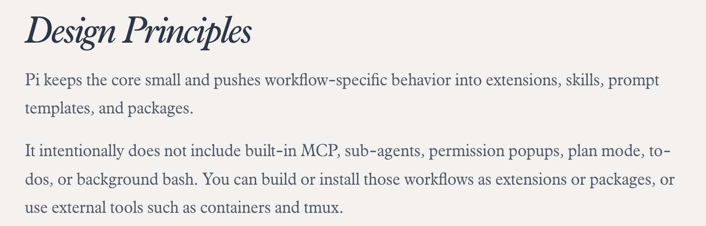
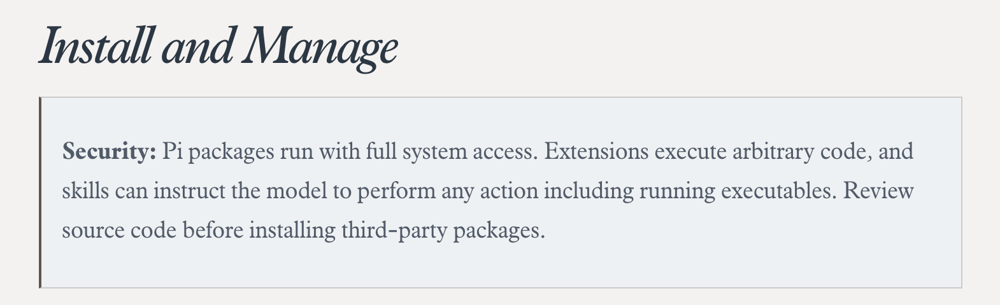

## 什么是 Pi ？

pi 又叫 pi coding agent，如果你没有听说过它，那你一定听说过 openclaw。而 pi 则是 openclaw 背后的编码智能体框架。极简的设计哲学，是大家对它最大的共识。

所以我们先来了解一下，pi 的能力边界是什么。

一切都围绕着极简二字，0 配置的 pi agent 只支持 4 种工具：bash、read、write 和 edit，没有 mcp 、没有 sub-agents、没有 plan mode 、没有 permision popups。一切都没有，都需要自己配置。看到这，如果你想要一个开箱即用的 coding agent ，那么可以转向 Codex 和 Claude Code。

正如作者的设计原则中所说，Pi 保持内核精简，将工作流相关行为推向了拓展、skills、提示词模板以及包中。后文中我将重点介绍这些可定制化的部分，以及如何搭建起属于自己的 Harness。

## 什么是 Extension ？

这是 Pi 框架中的第一个抽象，扩展是 TypeScript 模块，用于扩展 Pi 的行为。它们可以订阅生命周期事件、注册可由 LLM 调用的自定义工具、添加命令等。位置在 `.pi/agent/extensions/*` 目录下，Pi 会自动发现这些拓展，或者可用 `/reload` 命令进行热更新。

下面会重点讲拓展的关键能力：

1. 自定义工具/自定义命令：分别通过 `pi.registerTool()` 和 `pi.registerCommand()` 注册大模型自定义工具和斜杠命令。
2. 事件拦截：阻止或修改工具调用、注入上下文、自定义压缩。Pi 提供了非常丰富的生命周期（LifeCycle）事件用来注册，基本可以满足大部分需求。[官方文档](https://pi.dev/docs/latest/extensions#events)
3. 用户交互/界面渲染：Pi 也允许用户自定义交互逻辑和渲染逻辑，比如写一个提问 QA 的问答框、自定义 Editor 样式或者写一个等待模型输出时的小游戏（例如：贪吃蛇、飞机大战等）
4. 会话持久化：通过 `pi.appendEntry()` 存储重启后仍保留的状态。可以用来做一个类似 todo 的拓展。

其实写到这，就非常像 neovim 插件了，熟悉的 `eport function`。还有对插件各生命周期的控制，太熟悉了。

**如何写一个 Pi 拓展？**

在 AI 时代，我们不必再像 neovim 时期，自己动手写 lua 代码，最简单的方式或许就是和 Pi 说清楚你的需求，让它自己去写一个，并且通过热加载马上生效。所以你可以对 Pi 说：

> 我想写一个叫做 permision-gate 的 Pi Extension，作用是 Prompts for confirmation before dangerous bash commands (rm -rf, sudo, etc.)

再比如，我想通过插件形式，完全实现像 Claude Code 格式的 hooks 功能，你可以对 Pi 说：

> 我想写一个叫做 CC-hooks 的插件，用来将 Pi 原生的事件拦截能力，包装成像 Claude Code Hooks 一样的用法。

## 什么是 Prompt Templates ？

其实这个更像 Claude Code 的自定义斜杠命令，而上面拓展中的自定义命令更加的强大，可以调用 Pi 内部提供的 API。

格式：一个带 front-matter 的 markdown 文件

front-matter：包括 description 和 argument-hint，这两个都是可选的，会显示在下拉菜单中的描述和参数。

模板还支持位置参数和切片，比如用 $1 和 $2 以及 ${@:N} 这种使用方式，具体说明见 [模板参数](https://pi.dev/docs/latest/prompt-templates#arguments) 。

## 什么是 Pi Package ？

Pi Package 是 Pi 的另一抽象，简单来说就是 extensions, skills, prompt templates, or themes 的集合，这让 Pi 的配置可以很方便的通过 git 或者 npm 分享和安装。说起来有点像发行版的概念，但又不完全是，因为 Pi Package 可以多个共存，这是 **Pi 配置可分享的最小单元**。

但是便捷背后也意味着可能出现的安全隐患，Pi 作者特意强调了安全问题：Pi 包以完整系统权限运行。扩展程序可执行任意代码，技能则能指示模型执行包括运行可执行文件在内的任何操作。所以安装第三方包前请务必先审查源代码。

当然，Pi 包的创建也可以直接通过 Pi 去完成，官方文档 [参考这里](https://pi.dev/docs/latest/packages)

## Pi Package 推荐

截至 2026 年 5 月，[pi.dev/packages](https://pi.dev/packages) 已收录 **3,328+ 个包**。这里我推荐 10 个自己安装的。文末会给出我搜集的 awesome-pi 仓库供大家选择。

1. **context-mode**：节省 98% 上下文窗口，提供沙箱代码执行、FTS5 知识库和意图驱动搜索，Pi 用户几乎必装。
2. **pi-subagents**：子代理任务委派，支持链式调用、并行执行和 TUI 交互确认，让一个主代理调度多个子代理协作完成复杂任务。
3. **pi-mcp-adapter**：MCP (Model Context Protocol) 适配器，让 Pi 能连接外部 MCP 服务器，扩展工具能力（数据库、API、文件系统等）。
4. **pi-web-access**：Web 搜索、URL 抓取、GitHub 仓库克隆、PDF 提取、YouTube 视频理解，弥补 Pi 无法访问网络的短板。
5. **pi-lens：**实时代码反馈——LSP、linter、formatter、类型检查、结构分析。
6. **pi-simplify**：自动审查最近变更代码的清晰度、一致性和可维护性，代码质量守门员。
7. **@juicesharp/rpiv-todo**：给模型一个持久化 TODO 列表，以实时覆盖层渲染，即使 `/reload` 或上下文压缩也能保留。
8. **@plannotator/pi-extension**：交互式计划审查与批注，支持对代理消息做标注、审查代码/PR，适合复杂任务前的方案评审。
9. **@narumitw/pi-goal**：`/goal` 模式，保持代理工作直到任务完成。
10. **@narumirw/statusline**：丰富的状态栏，显示模型、工具、git 分支、上下文使用、token 总计、费用和时间。

## Awesome Pi

如果你想继续探索更多 Pi Package，我整理了一个持续更新的仓库：

## 结语

折腾 neovim 的时候我找的不是更好的工具，是在构建工具的过程里找到一种思维方式的投影 —— Pi 让我再次找到了这种感觉。
