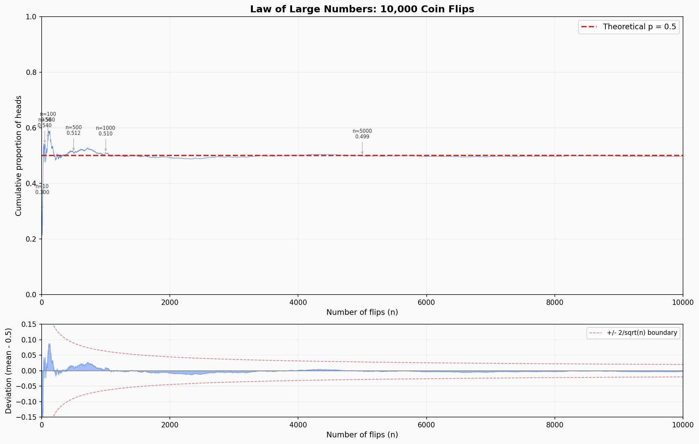

import DemoBrowser from '../../../components/mdx/DemoBrowser';

这是学习量化的第一篇笔记。

最近让 Hermes Agent 用 llm-wiki 创建了一个量化的 wiki，塞了两篇 [@MrRyanChi](https://x.com/MrRyanChi) 的文章进去。

---

## 大数定律实验

用 Python 模拟 10000 次抛硬币的实验

最终得到的结果是这样的

上图纵轴是累计比例，显示的是前 $N$ 次中，出现正面朝上的概率。

这是大数定律的核心：$n$ 很小时（比如前 10 次只有 30% 正面），均值剧烈波动；随着 $n$ 增大，曲线像被一根无形的线（$p=0.5$）拉住一样收紧，最终几乎贴合。

下图纵轴是偏差 = 均值 $-$ $0.5$

展示了偏差的衰减速度，红色虚线是 $\pm\dfrac{2}{\sqrt{n}}$ 理论边界——中心极限定理告诉我们大约 95% 的偏差会落在这个范围内。可以看到大部分蓝色波动确实被框在红线之内，而且边界在快速收缩。

这和 Polymarket 的关系很直接：一个市场只有几笔交易时，价格可能被少数订单推到离谱的位置；但随着交易量增长，市场价会向真实概率收敛。做市商的 edge 就来自在 n 小、波动大的时候提供流动性。

---

## 贝叶斯定理

$$
P(A \mid B) = \frac{P(B \mid A)\,P(A)}{P(B)}, \quad P(B) > 0
$$

公式解释：在已知 B 已经发生的情况下，A 发生的概率，等于 A 原本发生的概率，乘上"如果 A 发生时 B 会出现的概率"，再除以 B 本身发生的概率。

这里不是一个静态的公式，是在知道 B 发生的情况下，如何去修正 A 发生的概率。工程一点地说，它解决的是这个问题：**当信息不完整、证据不完美时，怎样持续修正信念。**

### 在量化交易里，这个公式有什么用呢？

在交易语境里翻译过来就是：

$$
P(\theta \mid data) = \frac{P(data \mid \theta)\,P(\theta)}{P(data)}
$$

- **先验** $P(\theta)$：在看到今天行情之前，你对"市场处于某种状态"的判断（比如牛市概率 60%）
- **似然** $P(data|\theta)$：如果市场真的处于那种状态，观察到当前信号的概率
- **后验** $P(\theta|data)$：综合今天的数据之后，更新后的判断

再直白一点：

- 你心里先有一个预估（比如：我觉得这件事有 50% 的概率发生）。
- 突然，你看到了一个新证据（比如：出了一条利好新闻）。
- 你问自己两个问题：如果这件事真的会发生，出这条新闻的可能性有多大？如果这件事根本不会发生，出这条新闻的可能性又有多大？
- 根据这两个问题的答案，你调整你心里的预估（比如：从 50% 调高到 58%）。

### 一个在 Polymarket 市场中的实际例子

<DemoBrowser
  src="/demos/polymarket-bayes/index.html"
  title="Polymarket 贝叶斯分析演示"
  height={520}
  client:visible
/>

---

## 凯利公式

$$
\boxed{f^* = \frac{pb - q}{b}}
$$

其中 $f^*$ 是最优押注比例，$p$ 是胜率，$b$ 是赔率，$q = 1-p$ 是败率。

凯利公式是回答一个问题的：**在一个有正期望的赌局里，每次应该押多少比例的资金，才能让长期财富增长最快？**

这个问题也是在**期望收益最大化**和**破产风险控制**之间找到数学最优点。

我们一步一步来推导看看：

### 设定场景

首先，假设你的初始资金是 $W_0$，每次押注比例为 $f$（即押 $f \cdot W$ 元）。

每次赌局：

- 概率 $p$ 赢，资金变为 $W(1 + fb)$
- 概率 $q = 1-p$ 输，资金变为 $W(1 - f)$

其中 $b$ 是赔率（赢了每押 1 元赚 $b$ 元）。

### 第一步：写出 n 次后的财富

押注 $n$ 次，假设赢了 $k$ 次，输了 $(n - k)$ 次：

$$
W_n = W_0 \cdot (1 + fb)^k \cdot (1 - f)^{n - k}
$$

这是一个**乘法过程**，每次结果都在上一次的基础上乘以一个系数。

### 第二步：为什么不直接最大化期望值

直觉上你可能想最大化 $\mathbb{E}[W_n]$。算一下：

$$
\mathbb{E}[W_n] = W_0 \cdot [p(1+fb) + q(1-f)]^n
$$

对 $f$ 求导令其为零，会得到：如果 $pb > q$（即具有正期望），应该押 $f = 1$，也就是**全押**。

但全押是灾难性的——只要输一次就归零，然后永远回不来。期望值被少数"全赢"的路径拉高，掩盖了破产的现实。

期望值最大化忽略了财富增长的**乘法结构**。

### 第三步：换目标——最大化长期增长率

对 $W_n$ 取对数：

$$
\log W_n = \log W_0 + W \cdot \log(1+fb) + L \cdot \log(1-f)
$$

$n$ 次后的**平均每次增长率**（对数增长率）：

$$
G = \frac{\log W_n - \log W_0}{n} = \frac{W}{n} \cdot \log(1+fb) + \frac{L}{n} \cdot \log(1-f)
$$

当 $n$ 足够大时，由大数定律：

$$
\frac{W}{n} \to p, \quad \frac{L}{n} \to q
$$

所以长期增长率收敛到：

$$
G(f) = p \cdot \log(1+fb) + q \cdot \log(1-f)
$$

**这就是我们真正要最大化的目标。**

### 第四步：对 f 求导

$$
G(f) = p \cdot \log(1+fb) + q \cdot \log(1-f)
$$

对 $f$ 求导：

$$
G'(f) = \frac{pb}{1+fb} + \frac{-q}{1-f}
$$

令 $G'(f) = 0$，最后计算得到：

$$
\boxed{f^* = \frac{pb - q}{b}}
$$

### 第五步：验证这是最大值

对 $G(f)$ 求二阶导：

$$
G''(f) = -\frac{pb^2}{(1+fb)^2} - \frac{q}{(1-f)^2}
$$

两项都是负数，所以 $G''(f) < 0$ 恒成立——这是**严格凹函数**，$f^*$ 确实是全局最大值。

### 第六步：回到 Polymarket 的特殊形式

Polymarket 里，花 $p_m$ 买入，事件发生时得到 $1$，所以：

- 赢了赚 $1 - p_m$，赔率 $b = \dfrac{1 - p_m}{p_m}$
- 输了亏 $p_m$，即 $f$ 单位对应亏损比例为 $p_m$

代入 $f^* = \dfrac{pb - q}{b}$，其中 $q = 1 - p$：

$$
f^* = \frac{p \cdot \dfrac{1-p_m}{p_m} - (1-p)}{\dfrac{1-p_m}{p_m}}
$$

计算得到最后的结果：

$$
\boxed{f^* = \frac{p - p_m}{1 - p_m}}
$$

**你的后验概率减去市场定价，除以输的空间。** Edge 越大，仓位越重；没有 edge（$p = p_m$），仓位为零。

凯利给出了每笔交易应该使用多少资金的数学方法，把**仓位管理**变成了一个可计算的数学题。

### 在量化交易中的作用

1. 实战多用半凯利

但是实战中其实多用的是半凯利公式，因为全凯利公式在实战用执行起来会有一定的心理压力，虽然是数学上最优的，但是对概率误差非常敏感，所以大多数基金更用半凯利更多一点。牺牲了自己的最优增长率，换来更平滑的资金曲线。

2. 连接贝叶斯

凯利公式需要 $p$——你对事件概率的估计。这个 $p$ 从哪来？正是贝叶斯更新后的后验概率。两个框架在这里自然衔接：**贝叶斯负责估计概率，凯利负责决定仓位。**
